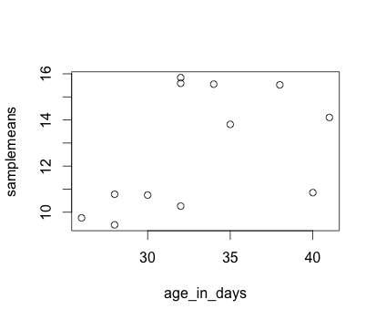
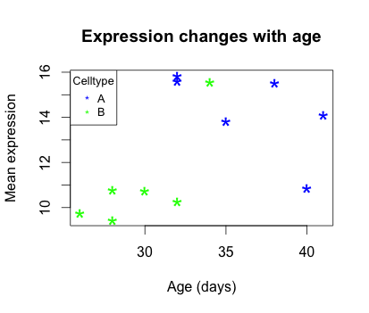
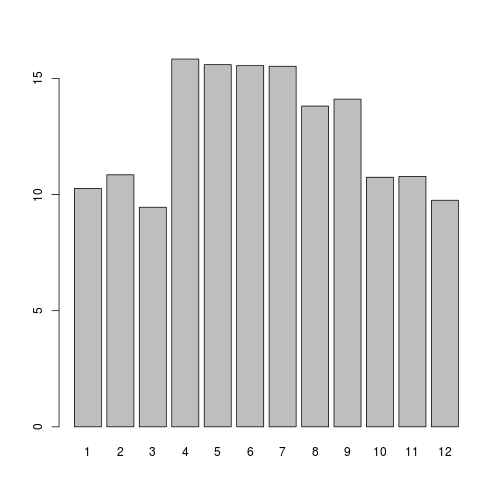
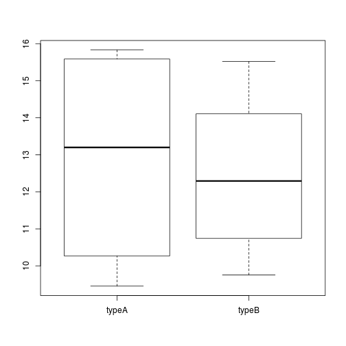
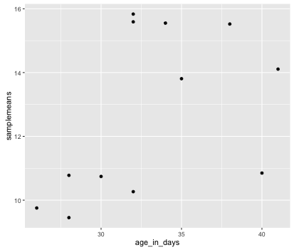
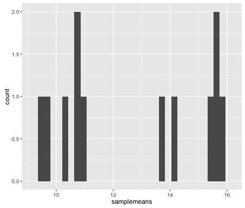
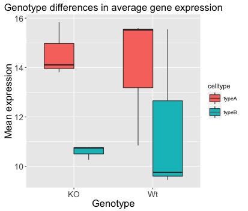

Approximate time: 90 minutes

## Learning Objectives 

* Visualizing data using basic plots in R
* Advanced plots (introducing `ggplot`)
* Exporting images to file


## Data Visualization

When we are working with large sets of numbers it can be useful to display that information graphically to gain more insight. Visualization deserves an entire course of its own (there is that much to know!). During this lesson we will get you started with the basics of plotting by exploring a few features of R's base plotting package and then compare those to some more of advanced features using the popular Bioconductor package `ggplot2`.

## Basic plots in R
R has a number of built-in tools for basic graph types such as histograms, scatter plots, bar charts, boxplots and much [more](http://www.statmethods.net/graphs/). Rather than going through all of different types, we will focus on `plot()`, a generic function for plotting x-y data. 

To get a quick view of the different things you can do with `plot`, let's use the `example()` function:
```r	
 example("plot")
```

Here, you will find yourself having to press `<Return>` so you can scroll through the different types of graphs generated by `plot`. Take note of the different parameters used with each command and how that affects the aesthetics of the plot. 

### Scatterplot
For some hands-on practice we are going to use `plot` to draw a scatter plot and obtain a graphical view of the relationship between two sets of continuous numeric data. From our new_metadata file we will take the `samplemeans` column and plot it against a new column, we are going to call `age_in_days`, to see how mean expression changes with age. 

```r	
age_in_days <- c(40, 32, 38, 35, 41, 32, 34, 26, 28, 28, 30, 32)    
# Create a numeric vector with ages. Note that there are 12 elements here.
	
new_metadata <- cbind(new_metadata, age_in_days)    
# add the new vector as the last column to the new_metadata dataframe
```

> *NOTE:* If you were unable to create the new metadata data frame in the last lesson, you can download it using [this link](https://github.com/hbc/NGS_Data_Analysis_Summer2016/raw/master/sessionIII/data/new_metadata.csv). Move the file into your working directory and from within RStudio load in the file using `read.csv()`.

Now our metadata has all the information to draw a scatterplot. The base R function to do this is `plot(y ~ x, data)`:
```r
plot(samplemeans ~ age_in_days, data=new_metadata)
```

  

Each point represents a sample. The values on the y-axis correspond to the average expression for each sample which is dependent on the x-axis variable `age_in_days`. This plot is in its simplest form, we can customize many features of the plot (fonts, colors, axes, titles) through [graphic options](http://www.statmethods.net/advgraphs/parameters.html).

For example, let's start by giving our **plot a title and renaming the axes**. We can do that by simply adding the options `xlab`, `ylab` and `main` as arguments to the `plot()` function:

```r
plot(samplemeans ~ age_in_days, data=new_metadata, main="Expression changes with age", xlab="Age (days)", 
	ylab="Mean expression")
```	
	
 


We can also change the **shape of the data point using the `pch`** option and the **size of the data points using `cex`** (specifying the amount to magnify relative to the default).

```r
plot(samplemeans ~ age_in_days, data=new_metadata, main="Expression changes with age", xlab="Age (days)", 
	ylab="Mean expression", pch="*", cex=2.0)
```


We can also add some **color to the data points** on the plot by adding `col="blue"`. Alternatively, you can sub in any of the default colors or you can [experiment with other R packages](http://www.stat.ubc.ca/~jenny/STAT545A/block14_colors.html#basic-color-specification-and-the-default-palette) to fiddle with better palettes. 

We can also add color to **separate the data points by information** in our data frame. For example, suppose we wanted to the data points colored by celltype. We would need to specify a vector of colours and provide the factor by which we are separating samples. The first level in our factor vector (which by default is assigned alphabetically) would get assigned the first color that we list. So in this case, blue corresponds to celltype A samples and green corresponds to celltype B.

```r
plot(samplemeans ~ age_in_days, data=new_metadata, main="Expression changes with age", xlab="Age (days)", 
	ylab="Mean expression", pch="*", cex=2.0, col=c("blue", "green")[celltype])
```


The last thing this plot needs is a **figure legend describing the color scheme**. It would be great if it created one for you by default, but with R base functions unfortunately it is not that easy. To draw a legend on the current plot, you need to run a **new function called `legend()`** and specify the appropriate arguments. The code to do so is provided below. Don't worry if it seems confusing, we plan on showing you a much more intuitive way of plotting your data.

```r
legend("topleft", pch="*", col=c("blue", "green"), c("A", "B"), cex=0.8,
 	title="Celltype")
```


***

**Exercise** 


1. Change the color scheme in the scatterplot, such that it reflects the `genotype` of samples rather than `celltype`.

2. Use R help to find out how to increase the size of the text on the axis labels.

***

### Barplot
Barplots are useful for comparing the distribution of a quantitative variable (numeric) between groups or categories. A **barplot**  would be much more useful to compare the samplemeans (numeric variable) for each sample. We can use `barplot` to draw a single bar representing each sample and the height indicates the average expression level. 


```r
?barplot
# note that there is no "data=" argument for barplot()

barplot(new_metadata$samplemeans)
```

This plot is not very useful without labels (sample names) for the bars  on the x-axis, let's add the names using `names.arg`.

```r
barplot(new_metadata$samplemeans, names.arg = row.names(new_metadata))
```

  

The sample names appear to be too large for the plot, we can change that by changing the `cex.names` value. 


```r
barplot(new_metadata$samplemeans, names.arg = row.names(new_metadata), cex.names = 0.5)
```

  

The names are too small to read. Alternatively, we can also just change the names to be numeric values and keep the same size.


```r
barplot(new_metadata$samplemeans, names.arg = c(1:12)) # supply numbers as labels
```

  

We can also flip the axes so that the plot is projected horizontally.


```r
barplot(new_metadata$samplemeans, names.arg = c(1:12), horiz = TRUE)
```

  

And we can add some color as we did before using the `col=` argument, so that the bars are colored based on the `genotype`. 
```r
barplot(new_metadata$samplemeans, names.arg=c(1:12), horiz=TRUE, col=c("darkblue", "red")[new_metadata$genotype]) 
```	
  

### Histogram
If we are interested in an overall distribution of numerical data, a **histogram** is what we'd want. To plot a histogram of the data use the `hist` command:

```r
hist(new_metadata$samplemeans)
```

  

The range of values for sample means is 9 to 16. As you can see R will automatically calculate the intervals to use. There are many options to determine how to break up the intervals. Let's increase the number of breaks to see how that changes the plot:

```r
hist(new_metadata$samplemeans, xlab="Mean expression level", main="", breaks=20) 
```

  

Similar to the other plots we can tweak the aesthetics. Let's color in the bar and remove the borders:


```r
hist(new_metadata$samplemeans, xlab="Mean expression level", main="", col="darkgrey", border=FALSE) 
```

  

### Boxplot

Using addiitonal sample information from our metadata, we can use plots to compare values between different factor levels or categories. For example, we can compare the sample means across celltypes 'typeA' and 'typeB' using a **boxplot**.

A boxplot provides a graphical view of the distribution of data based on a five number summary. The top and bottom of the box represent the (1) first and (2) third quartiles (25th and 75th percentiles, respectively). The line inside the box represents the (3) median (50th percentile). The whiskers extending above and below the box represent the (4) maximum, and (5) minimum of a data set. The whiskers of the plot reach the minimum and maximum values that are not outliers. 

Outliers are determined using the interquartile range (IQR), which is defined as: Q3 - Q1. Any values that exceeds 1.5 x IQR below Q1 or above Q3 are considered outliers and are represented as points above or below the whiskers. These outliers are useful to identify any unexpected observations.

```r
# Boxplot
boxplot(samplemeans~celltype, data=new_metadata)
```

  

## Advanced figures (`ggplot2`)


More recently, R users have moved away from base graphic options towards a plotting package called [`ggplot2`](http://docs.ggplot2.org/). This package adds a lot of functionality to the basic plots described above. The syntax takes some getting used to, but once you have it you will find it's extremely powerful and flexible. We can start by re-creating the scatterplot but using ggplot functions to get a feel for the syntax.

`ggplot2` is best used on data in the `data.frame` form, so we will will continue to work with `new_metadata` for the following figures. Let's start by loading the `ggplot2` library.

```{r}
library(ggplot2)
```

The `ggplot()` function is used to **initialize the basic graph structure**, then we add to it. The basic idea is that you specify different parts of the plot, and add them together using the `+` operator. These parts are often referred to as layers.

Let's start: 

```{r, eval=FALSE}
ggplot(new_metadata) # what happens? 
```
You get an blank plot, because you need to **specify layers** using the `+` operator.

One type of layer is **geometric objects**. These are the actual marks we put on a plot. Examples include:

* points (`geom_point`, `geom_jitter` for scatter plots, dot plots, etc)
* lines (`geom_line`, for time series, trend lines, etc)
* boxplot (`geom_boxplot`, for, well, boxplots!)

For a more exhaustive list on all possible geometric objects and when to use them check out [Hadley Wickham's RPubs](http://rpubs.com/hadley/ggplot2-layers). 

A plot **must have at least one `geom`**; there is no upper limit. You can add a `geom` to a plot using the `+` operator

```{r, eval=FALSE}
ggplot(new_metadata) +
  geom_point() # note what happens here
```

You will find that even though we have added a layer by specifying `geom_point`, we get an error. This is because each type of geom usually has a **required set of aesthetics** to be set. Aesthetic mappings are set with the aes() function and can be set inside `geom_point()` to be specifically applied to that layer. If we supplied aesthetics within `ggplot()`, they will be used as defaults for every layer. Examples of aesthetics include:

* position (i.e., on the x and y axes)
* color ("outside" color)
* fill ("inside" color) 
* shape (of points)
* linetype
* size

To start, we will add position for the x- and y-axis since `geom_point` requires the most basic information about a scatterplot, i.e. what you want to plot on the x and y axes. All of the others mentioned above are optional.

```{r, fig.align='center'}
ggplot(new_metadata) +
     geom_point(aes(x = age_in_days, y= samplemeans))
```

  


Now that we have the required aesthetics, let's add some extras like color to the plot. We can **`color` the points on the plot based on genotype**, by specifying the column header. You will notice that there are a default set of colors that will be used so we do not have to specify. Also, the **legend has been conveniently plotted for us!**


```{r, fig.align='center'}
ggplot(new_metadata) +
  geom_point(aes(x = age_in_days, y= samplemeans, color = genotype)) 
```

  


Alternatively, we could color based on celltype by changing it to `color =celltype`. Let's try something different and have both **celltype and genotype identified on the plot**. To do this we can assign the `shape` aesthetic the column header, so that each celltype is plotted with a different shaped data point. Add in `shape = celltype` to your aesthetic and see how it changes your plot:

```{r, fig.align='center'}
ggplot(new_metadata) +
  geom_point(aes(x = age_in_days, y= samplemeans, color = genotype,
  			shape=celltype)) 
`````

  


The **size of the data points** are quite small. We can adjust that within the `geom_point()` layer, but does **not** need to be **included in `aes()`** since we are specifying how large we want the data points, rather than mapping it to a variable. Add in the `size` argument by specifying a number for the size of the data point:

```{r, fig.align='center'}
ggplot(new_metadata) +
  geom_point(aes(x = age_in_days, y= samplemeans, color = genotype,
  			shape=celltype), size=3.0) 
`````

 
  

The labels on the x- and y-axis are also quite small and hard to read. To change their size, we need to add an additional **theme layer**. The ggplot2 `theme` system handles non-data plot elements such as:

* Axis label aesthetics
* Plot background
* Facet label backround
* Legend appearance

There are built-in themes we can use (i.e. `theme_bw()`) that mostly change the background/foreground colours, by adding it as additional layer. Or we can adjust specific elements of the current default theme by adding the `theme()` layer and passing in arguments for the things we wish to change. Or we can use both.

Let's add a layer `theme_bw()`. Do the axis labels or the tick labels get any larger by changing themes?

```{r, fig.align='center'}
ggplot(new_metadata) +
  geom_point(aes(x = age_in_days, y= samplemeans, color = genotype,
  			shape=celltype), size=3.0) +
  theme_bw() 
`````

Not in this case. But we can add arguments using `theme()` to change it ourselves. Since we are adding this layer on top (i.e later in sequence), any features we change will override what is set in the `theme_bw()`. Here we'll **increase the size of the axes labels and axes tick labels to be 1.5 times the default size.** When modfying the size of text we often use the `rel()` function. In this way the size we specify is relative to the default (similar to `cex` for base plotting). We can also provide the number vaue as we did with the data point size, but can be cumbersome if you don't know what the default font size is to begin with. 

```{r, fig.align='center'}
ggplot(new_metadata) +
  geom_point(aes(x = age_in_days, y= samplemeans, color = genotype,
  			shape=celltype), size=3.0) +
  theme_bw() +
  theme(axis.text = element_text(size=rel(1.5)),
  		axis.title = element_text(size=rel(1.5)))			
`````
 
 
 

> *NOTE:* You can use the `example("geom_point")` function here to explore a multitude of different aesthetics and layers that can be added to your plot. As you scroll through the different plots, take note of how the code is modified. You can use this with any of the different geometric object layers available in ggplot2 to learn how you can easily modify your plots! 


***

**Exercise**

1. The current axis label text defaults to what we gave as input to `geom_point` (i.e the column headers). We can change this by **adding additional layers** called `xlab()` and `ylab()` for the x- and y-axis, respectively. Add these layers to the current plot such that the x-axis is labeled "Age (days)" and the y-axis is labeled "Mean expression".
2. Use the `ggtitle` layer to add a title to your plot.

***


## Histogram

To plot a histogram we require another type of geometric object called `geom_histogram`, which requires a statistical transformation. Some plot types (such as scatterplots) do not require transformations, each point is plotted at x and y coordinates equal to the original value. Other plots, such as boxplots, histograms, prediction lines etc. need to be transformed. Usually these objects have has a default statistic for the transformation, but that can be changed via the `stat_bin` argument. 

Let's plot a histogram of sample mean expression in our data:

```r
ggplot(new_metadata) +
  geom_histogram(aes(x = samplemeans))
```


  
 

You will notice that even though the histogram is plotted, R gives a warning message ``stat_bin()` using `bins = 30`. Pick better value with `binwidth`.` These are the transformations we discussed. Apparently the default is not good enough. 

Let's change the binwidth values. How does the plot differ?

```{r, fig.align='center'}
ggplot(new_metadata) +
  geom_histogram(aes(x = samplemeans), stat = "bin", binwidth=0.8)
```

  

***

**Exercise**

1. Use what you learned previously about the `theme()` layer to make the text larger for x- and y-axis (not the tick labels).
2. Also, add an appropriate title to this plot.

***


## Boxplot

Now that we have all the required information for plotting with ggplot2 let's try plotting a boxplot.

1. Use the `geom_boxplot()` layer to plot the differences in sample means between the Wt and KO genotypes.
2. Add a title to your plot.
3. Add 'Genotype' as your x-axis label and 'Mean expression' as your y-axis labels.
4. Change the size of your axes labels to 1.5x larger than the default.
5. Change the size of your axes text (the labels on the tick marks) to 1.25x larger than the default.
6. Change the size of your plot title in the same way that you change the size of the axes text but use `plot.title`.

*BONUS: Use the `fill` aesthetic to look at differences in sample means between celltypes within each genotype.*


**Our final figure should look something like that provided below.**

 


## Exporting figures to file

There are two ways in which figures and plots can be output to a file (rather than simply displaying on screen). The first (and easiest) is to export directly from the RStudio 'Plots' panel, by clicking on `Export` when the image is plotted. This will give you the option of `png` or `pdf` and selecting the directory to which you wish to save it to. It will also give you options to dictate the size and resolution of the output image.

The second option is to use R functions and have the write to file hard-coded in to your script. This would allow you to run the script from start to finish and automate the process (not requiring human point-and-click actions to save).  In R’s terminology, **output is directed to a particular output device and that dictates the output format that will be produced**.  A device must be created or “opened” in order to receive graphical output and, for devices that create a file
on disk, the device must also be closed in order to complete the output.

Let's print our scatterplot to a pdf file format. First you need to initialize a plot using a function which specifies the graphical format you intend on creating i.e.`pdf()`, `png()`, `tiff()` etc. Within the function you will need to specify a name for your image, and the with and height (optional). This will open up the device that you wish to write to:
```r
pdf("figure/scatterplot.pdf")
```

If you wish to modify the size and resolution of the image you will need to add in the appropriate parameters as arguments to the function when you initialize. Then we plot the image to the device, using the ggplot scatterplot that we just created. 

```r
ggplot(metadata) +
  geom_point(aes(x = age_in_days, y= samplemeans, color = genotype,
  			shape=celltype), size=rel(3.0)) 
```

Finally, close the "device", or file, using the `dev.off()` function. There are also `bmp`, `tiff`, and `jpeg` functions, though the jpeg function has proven less stable than the others. 
  			
```r    
dev.off()
```

***Note 1:*** *You will not be able to open and look at your file using standard methods (Adobe Acrobat or Preview etc.) until you execute the `dev.off()` function.*

***Note 2:*** *If you had made any additional plots before closing the device, they will all be stored in the same file; each plot usually gets its own page, unless you specify otherwise.*


---
*This lesson has been developed by members of the teaching team at the [Harvard Chan Bioinformatics Core (HBC)](http://bioinformatics.sph.harvard.edu/). These are open access materials distributed under the terms of the [Creative Commons Attribution license](https://creativecommons.org/licenses/by/4.0/) (CC BY 4.0), which permits unrestricted use, distribution, and reproduction in any medium, provided the original author and source are credited.*
